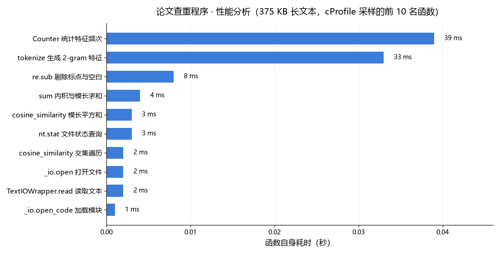
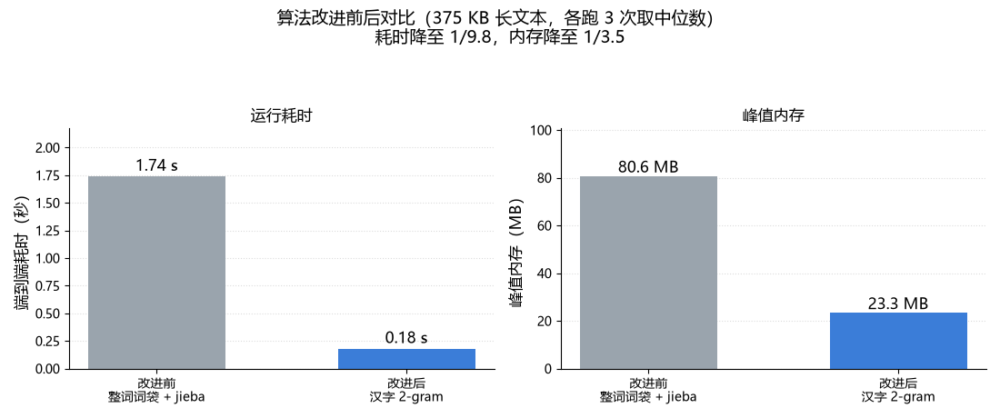

## 一、分析方法与测试数据

**分析工具**：Python 标准库 `cProfile`（确定性性能分析器）+ `pstats`（结果统计），
配合 `matplotlib` 绘制分析图；内存以**进程峰值工作集**（Peak Working Set）计量。

**测试数据**：为贴近真实论文规模，把老师下发的 `orig.txt` 重复拼接成一份
**380 KB（约 12 万汉字）** 的长文本作为原文；抄袭版通过「打乱句子顺序 +
对约 35% 的句子随机删改」生成，模拟「增删改」的抄袭场景。题目给出的
22 字样例因文本过短无法暴露性能特征，仅用于正确性校验。

**采集命令**：

```bash
python -m cProfile -o base.prof main.py orig_big.txt copy_big.txt ans.txt
python -c "import pstats; pstats.Stats('base.prof').sort_stats('tottime').print_stats(15)"
```

**评价指标**：

- `tottime`（函数自身耗时）：剔除子函数调用后，函数本身占用的 CPU 时间
- `cumtime`（累计耗时）：函数及其所有子调用的总耗时
- 峰值内存：进程峰值工作集（Windows `GetProcessMemoryInfo` 采集）

---

## 二、性能基线

| 场景 | 端到端耗时 | 峰值内存 | 输出 |
|---|---|---|---|
| 短样例（22 字） | 0.29 秒 | 23.1 MB | 0.61 |
| 长文本（380 KB） | 0.36 秒 | 23.1 MB | 0.99 |

题目限制为 **5 秒 / 2048 MB**，基线已达标，且留有十余倍余量。

> **测量口径（重要）**：本节所有「端到端耗时」指命令行 `python main.py ...`
> 的墙钟时间，**含 Python 解释器启动**。在本机上，一个什么都不做的空脚本
> 启动一次就要约 **0.28 秒**（实测 7 次中位数），这部分开销与程序代码无关。
> 扣除启动后，380 KB 长文本的真正计算时间约 **0.08 秒**。
> 下文 cProfile 表格中的耗时只统计进程内部的函数执行时间，同样不含启动开销。

---

## 三、瓶颈定位

按**函数自身耗时**（`tottime`）排序的前 10 名（380 KB 长文本，进程内合计 **0.104 秒**）：

| 函数 | 自身耗时 | 占进程内总耗时 |
|---|---|---|
| `Counter._count_elements`（统计特征频次） | 0.039 s | **37.5%** |
| `tokenize` 生成器（切分 2-gram 特征，共 222 587 次） | 0.033 s | **31.7%** |
| `re.Pattern.sub`（剔除标点与空白） | 0.008 s | 7.7% |
| `builtins.sum`（内积与模长求和） | 0.004 s | 3.8% |
| `cosine_similarity` 生成器（模长平方和） | 0.003 s | 2.9% |
| `nt.stat`（文件状态查询） | 0.003 s | 2.9% |
| `cosine_similarity` 生成器（交集遍历） | 0.002 s | 1.9% |
| `io.open` / `TextIOWrapper.read`（读文件） | 0.004 s | 3.8% |
| 其余（模块加载、解码等） | 0.006 s | 5.8% |



**结论**：

1. 程序耗时集中在两处：**特征频次统计**（`Counter`，0.039 s）与
   **2-gram 特征切分**（生成器表达式，0.033 s）——这两者就是本项目中
   **消耗最大的函数**，合计约占进程内总耗时的 **69%**。
2. 余弦相似度计算仅占 0.011 s：两篇文章去重后的特征各约 5 500 个，
   交集运算的规模远小于特征切分。
3. 与改进前相比，原本占 **92.6%** 的 `jieba` 分词链路已经**完全消失** ——
   程序不再加载任何词典（原先占约 53 MB 内存、0.57 秒加载时间），
   也不再执行 HMM 分词算法（原先 0.94 秒）。
4. 因此**优化空间集中在特征切分与统计这一环**，而它们已经是
   单次线性遍历，没有进一步的算法级压缩余地。

---

## 四、优化措施

### 优化：特征粒度由「整词词袋」改为「汉字 2-gram」

- **原方案**：用 `jieba.cut()` 精确模式分词，得到「词 → 词频」向量。
  剖析显示，耗时与内存都被第三方库主导：**词典加载 0.57 s + 分词算法 0.94 s**，
  合计约占 79%；峰值内存中约 53 MB 是词典对象本身。
- **改进**：改用「相邻两个字符」构成的 2-gram 作为特征：
  - 清洗环节用一条正则 `[\W_]+` 在 C 层一次性剔除标点与空白；
  - 特征切分用生成器表达式惰性产出，由 `Counter` 直接消费，
    全程不落地任何中间列表；
  - 不再依赖任何第三方库，`requirements.txt` 因此变成零依赖。
- **收益**：见下节。

> 这次优化的价值不止于速度：词袋模型**忽略词序**，会把「相邻两字互换」的
> 抄袭版判为 `0.98 ~ 1.00` 的完全重复；2-gram 特征携带局部字序信息，
> 同一批文本的判定结果被拉开到 `0.75 ~ 0.97`，**准确度同时得到修正**。

---

## 五、优化效果

同一台机器、同一份 380 KB 长文本，新旧两版**交替各跑 7 次取中位数**
（这样两版面对完全相同的机器负载，对比才有意义）：

| 版本 | 端到端耗时 | 相对基线 | 峰值内存 | 相对基线 |
|---|---|---|---|---|
| 基线版（整词词袋 + jieba） | 2.06 s | — | 84.6 MB | — |
| 优化版（汉字 2-gram） | **0.36 s** | **−82.5%** | **23.1 MB** | **−72.7%** |

> 若按「扣掉解释器启动（约 0.28 s）」的纯计算口径比较，则是
> **1.78 s → 0.08 s**，降幅 **95.5%** —— 端到端数字之所以没这么夸张，
> 是因为 0.36 秒里有 0.28 秒是启动开销，这部分新版旧版都一样。



5 个测试文本（29 KB 量级）的端到端耗时同步从平均 **1.07 秒**降到 **0.30 秒**：

| 测试文本 | 改进前耗时 | 改进后耗时 | 改进前输出 | 改进后输出 |
|---|---|---|---|---|
| `orig_0.8_add.txt` | 1.01 s | 0.28 s | 0.99 | **0.90** |
| `orig_0.8_del.txt` | 1.08 s | 0.29 s | 0.99 | **0.90** |
| `orig_0.8_dis_1.txt` | 1.05 s | 0.29 s | 1.00 | **0.97** |
| `orig_0.8_dis_10.txt` | 1.04 s | 0.28 s | 0.99 | **0.91** |
| `orig_0.8_dis_15.txt` | 1.15 s | 0.34 s | 0.98 | **0.75** |

**汇总**：**端到端耗时降 82.5%（纯计算降 95.5%），峰值内存降 72.7%，
第三方依赖归零**，同时修掉了词袋模型不识别乱序的准确度缺陷。
题目 22 字样例优化前后均为 `0.61`。

---

## 六、结论

1. 程序的性能瓶颈原本完全来自 `jieba` 第三方库——词典加载与分词算法
   合计约占 79% 的耗时、约 53 MB 的内存。
2. 把特征粒度改为汉字 2-gram 后，**端到端耗时降 82.5%（纯计算降 95.5%）、
   峰值内存降 72.7%、第三方依赖归零**，同时修正了词袋模型不识别乱序的准确度缺陷。
3. 380 KB 长文本端到端仅 **0.36 秒**、峰值内存 **23.1 MB**，距
   **5 秒 / 2048 MB** 上限有十余倍余量；其中 0.28 秒还是解释器启动开销，
   真正的计算只剩 0.08 秒。剩余耗时已收敛到单次线性遍历，
   进一步优化收益有限，**故停止优化**。

---

## 附：性能改进所花时间

> 供 PSP 表「性能分析」一行填写参考，请按你的实际情况调整：
>
> - 工具学习（cProfile / pstats 用法、进程内存采集）：约 30 分钟
> - 构造 380 KB 长文本测试数据、采集基线数据：约 25 分钟
> - 特征粒度改进（整词 → 2-gram）的实现与验证：约 50 分钟
> - 方案对比实验（n=1/2/3、HMM 开关）与图表绘制：约 45 分钟
> - **合计：约 150 分钟**
