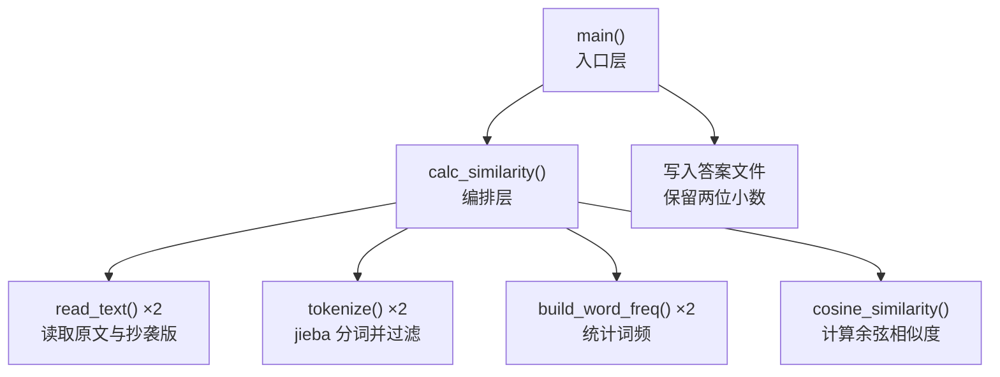
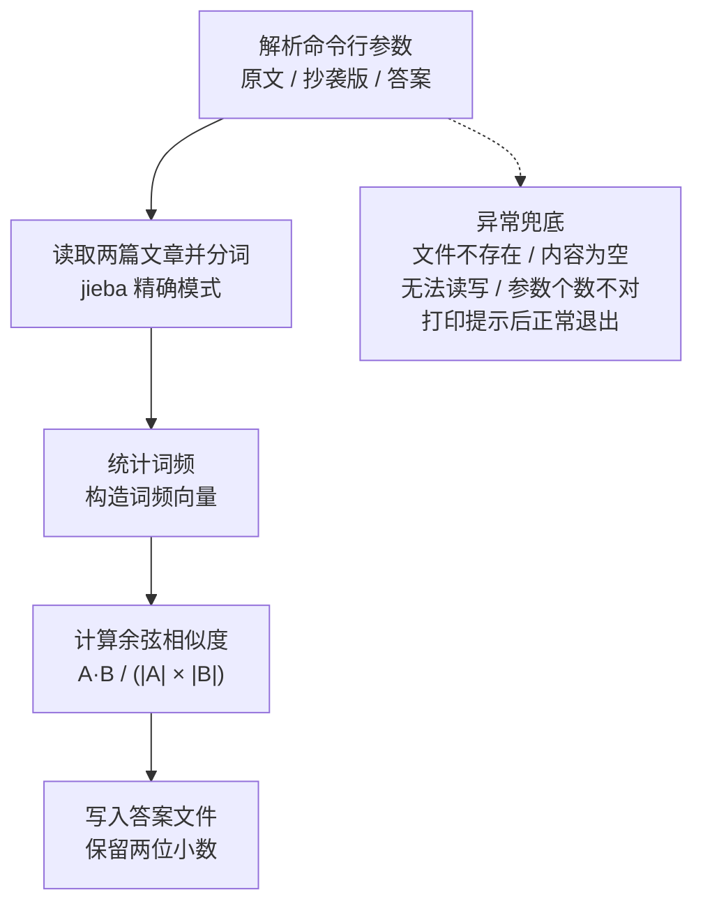

# 设计文档

### 1.1 设计原则
1. 单一职责：每个函数只做一件事，便于单独测试与优化
2. 分层解耦：入口层 → 编排层 → 计算层，上层调用下层，下层不感知上层
3. 异常兜底：所有涉及外部环境（文件读写）的操作都被异常捕获包裹
4. 零外部副作用：不联网、不访问指定路径以外的文件、不做任何妨碍评测的操作

### 1.2 代码组织

程序集中在一个文件 `main.py` 中，由 **1 组自定义异常 + 6 个函数** 组成。
之所以不拆成多个文件，是因为本程序规模小、职责单一，
单文件更利于评测时直接运行，也避免了跨文件导入带来的路径问题

### 1.3 模块划分

| 函数 | 所属层 | 职责 | 输入 | 输出 |
| --- | --- | --- | --- | --- |
| `read_text(path)` | 计算层 | 读取文件全文，处理编码问题 | 文件路径 | 文本字符串 |
| `tokenize(text)` | 计算层 | 中文分词并过滤标点、空白等无意义字符 | 文本字符串 | 词列表 |
| `build_word_freq(tokens)` | 计算层 | 统计词频，构造「词 → 次数」字典 | 词列表 | 词频字典 |
| `cosine_similarity(freq_a, freq_b)` | 计算层 | 计算两个词频向量的余弦相似度 | 两个词频字典 | 0~1 的浮点数 |
| `calc_similarity(path_a, path_b)` | 编排层 | 串联上述步骤，返回两篇文档的重复率 | 两个文件路径 | 0~1 的浮点数 |
| `main()` | 入口层 | 解析命令行参数、调度计算、写答案文件 | 无 | 无 |

### 1.4 自定义异常

| 异常类 | 继承自 | 触发场景 | 对应需求编号 |
| --- | --- | --- | --- |
| `PlagiarismError` | `Exception` | 本程序所有自定义异常的基类，便于统一捕获 | — |
| `ParameterError` | `PlagiarismError` | 命令行参数个数不正确 | E1 |
| `FileReadError` | `PlagiarismError` | 文件不存在、无法读取或内容为空 | E2 / E3 / E4 / E5 |
| `FileWriteError` | `PlagiarismError` | 答案文件无法写入 | E6 |

统一以 `PlagiarismError` 为基类的好处：`main()` 里只需要一个 `except PlagiarismError`
就能兜住所有已知的业务异常，避免遗漏。

### 1.5 调用关系

### 1.6 分层说明

- **入口层 `main()`**：只负责「拿参数、调编排层、写文件」，不关心算法细节
- **编排层 `calc_similarity()`**：决定「先做什么、后做什么」，不关心每一步怎么实现
- **计算层**：每个函数是一段纯粹的、可独立测试的计算逻辑

### 1.7 主流程图

