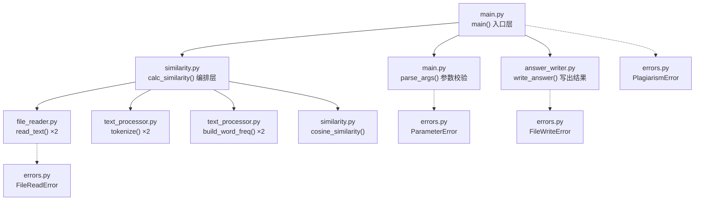
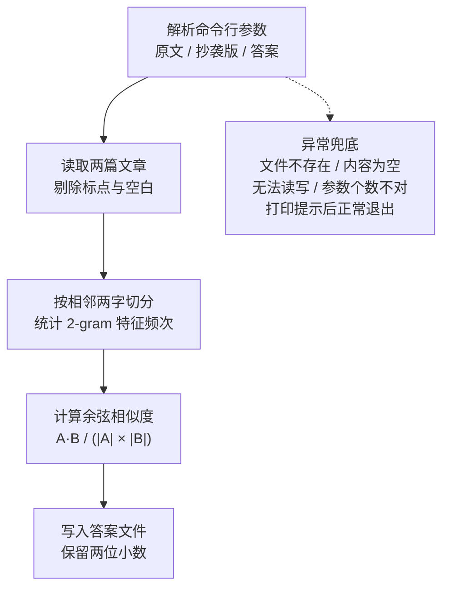

# 设计文档

### 1.1 设计原则
1. 单一职责：每个函数只做一件事，便于单独测试与优化
2. 分层解耦：入口层 → 编排层 → 计算层，上层调用下层，下层不感知上层
3. 异常兜底：所有涉及外部环境（文件读写）的操作都被异常捕获包裹
4. 零外部副作用：不联网、不访问指定路径以外的文件、不做任何妨碍评测的操作

### 1.2 代码组织

程序集中在一个文件 `main.py` 中，由 **1 组自定义异常 + 6 个函数** 组成。
之所以不拆成多个文件，是因为本程序规模小、职责单一，
单文件更利于评测时直接运行，也避免了跨文件导入带来的路径问题
| 文件 | 职责 | 对外提供 |
| --- | --- | --- |
| `main.py` | 入口骨架：解析命令行参数、调度、写出结果 | `parse_args(argv)` / `main()` |
| `errors.py` | 自定义异常体系 | `PlagiarismError` / `ParameterError` / `FileReadError` / `FileWriteError` |
| `file_reader.py` | 文件读取与多编码兼容 | `read_text(path)` |
| `text_processor.py` | 汉字 2-gram 特征切分与频次统计 | `tokenize(text)` / `build_word_freq(tokens)` |
| `similarity.py` | 余弦相似度计算与查重编排 | `cosine_similarity()` / `calc_similarity()` |
| `answer_writer.py` | 答案文件写出与两位小数格式化 | `write_answer(path, similarity)` |

### 1.3 函数职责

| 函数 | 所属模块 | 所属层 | 职责 | 输入 | 输出 |
| --- | --- | --- | --- | --- | --- |
| `read_text(path)` | `file_reader.py` | 计算层 | 读取文件全文，依次尝试多种编码 | 文件路径 | 文本字符串 |
| `tokenize(text)` | `text_processor.py` | 计算层 | 剔除标点空白后，按相邻两字切出 2-gram 特征 | 文本字符串 | 特征生成器 |
| `build_word_freq(tokens)` | `text_processor.py` | 计算层 | 统计特征频次，构造「特征 → 次数」映射 | 特征的可迭代对象 | 特征计数 Counter |
| `cosine_similarity(freq_a, freq_b)` | `similarity.py` | 计算层 | 计算两个特征向量的余弦相似度 | 两个特征字典 | 0~1 的浮点数 |
| `calc_similarity(path_a, path_b)` | `similarity.py` | 编排层 | 串联读取、切特征、统计、计算四步 | 两个文件路径 | 0~1 的浮点数 |
| `write_answer(path, value)` | `answer_writer.py` | 计算层 | 把重复率按两位小数写入答案文件 | 路径 + 浮点数 | 写入的文本 |
| `parse_args(argv)` | `main.py` | 入口层 | 校验参数个数并解析出三个路径 | 命令行参数列表 | 三个路径的元组 |
| `main()` | `main.py` | 入口层 | 调度计算并写出结果，返回退出码 | 无 | 退出码 |

### 1.4 自定义异常

| 异常类 | 继承自 | 触发场景 | 对应需求编号 |
| --- | --- | --- | --- |
| `PlagiarismError` | `Exception` | 本程序所有自定义异常的基类，便于统一捕获 | — |
| `ParameterError` | `PlagiarismError` | 命令行参数个数不正确 | E1 |
| `FileReadError` | `PlagiarismError` | 文件不存在、无法读取或内容为空 | E2 / E3 / E4 / E5 |
| `FileWriteError` | `PlagiarismError` | 答案文件无法写入 | E6 |

统一以 `PlagiarismError` 为基类的好处：`main()` 里只需要一个 `except PlagiarismError`
就能兜住所有已知的业务异常，避免遗漏。

### 1.5 调用关系

### 1.6 分层说明

- **入口层 `main()`（main.py）**：只负责「拿参数、调编排层、写文件」，不关心算法细节；
  参数校验由同文件的 `parse_args()` 承担，个数不对即抛 `ParameterError`
- **编排层 `calc_similarity()`（similarity.py）**：决定「先做什么、后做什么」，
  不关心每一步怎么实现
- **计算层（file_reader.py / text_processor.py / similarity.py / answer_writer.py）**：
  每个函数是一段纯粹的、可独立测试的计算逻辑
- **公共层（errors.py）**：仅定义异常类型，被各层引用，不依赖任何其它模块

这样分层分模块后，单元测试可以只针对单个函数构造输入，
`tokenize()`、`build_word_freq()`、`cosine_similarity()` 都是纯函数，
不需要真的准备文件，测试用例更轻、更快。

### 1.7 主流程图

